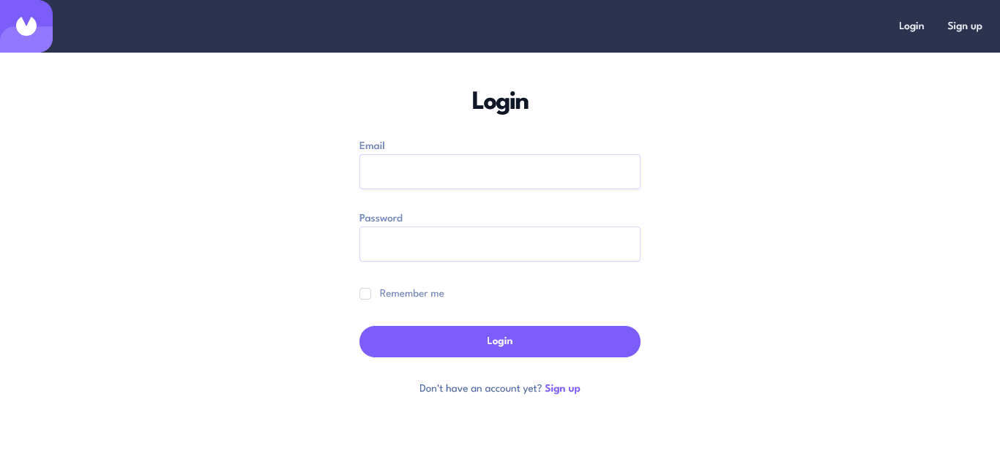
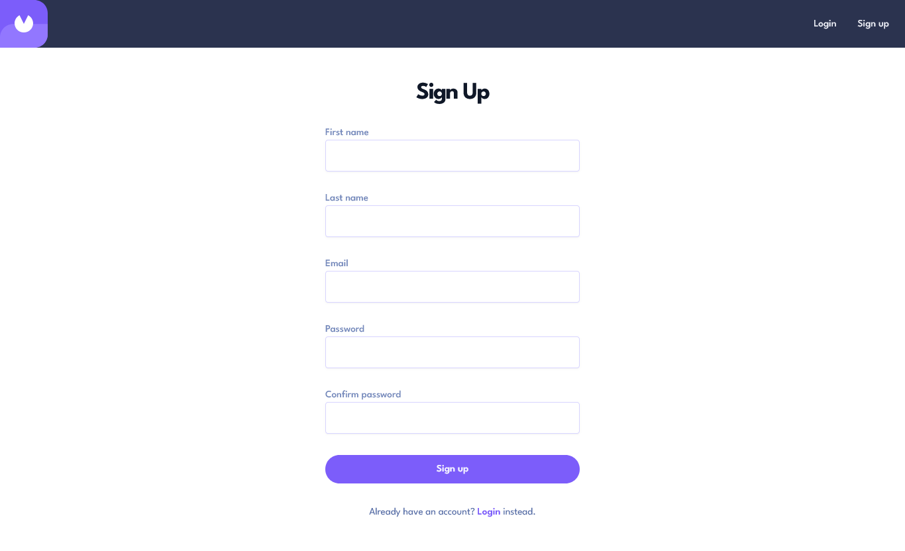
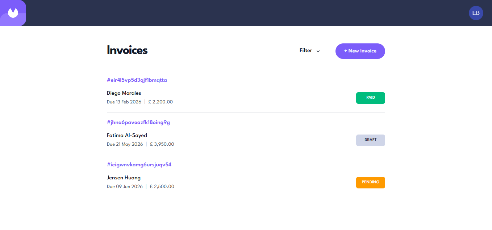
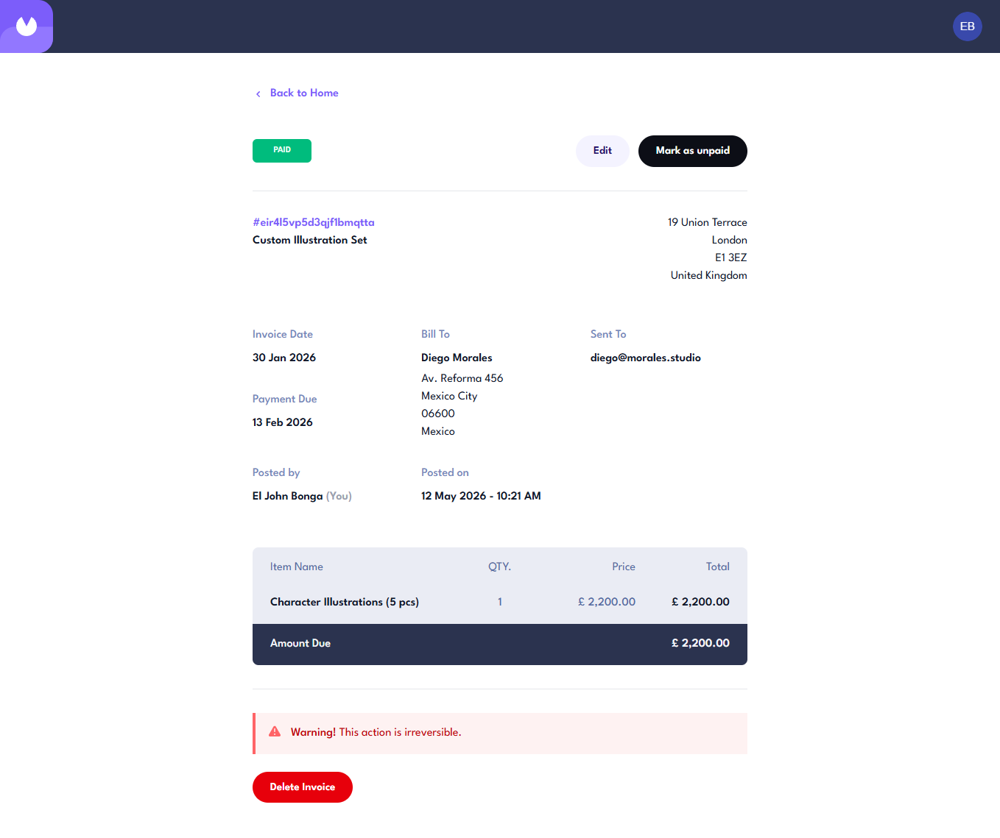
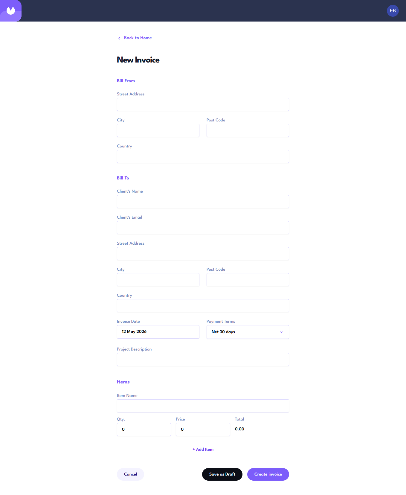
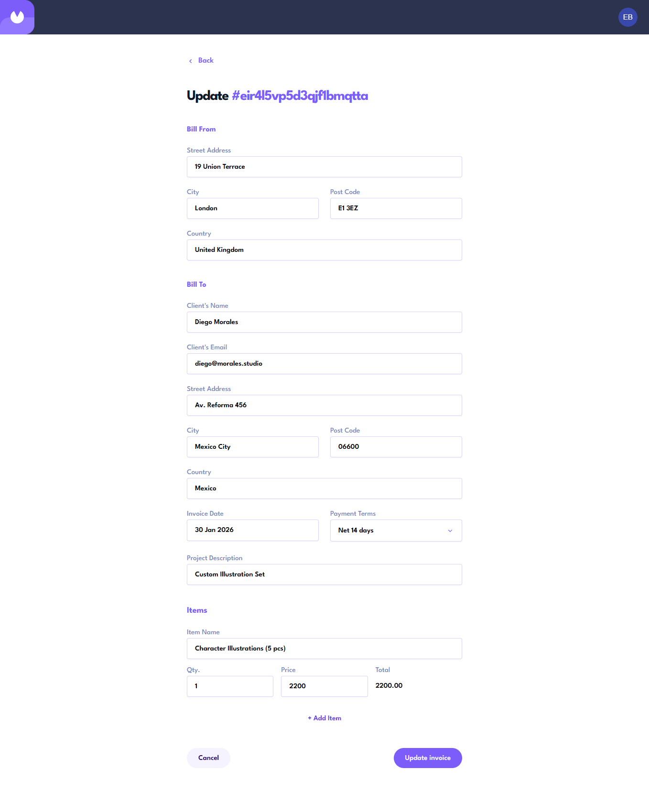
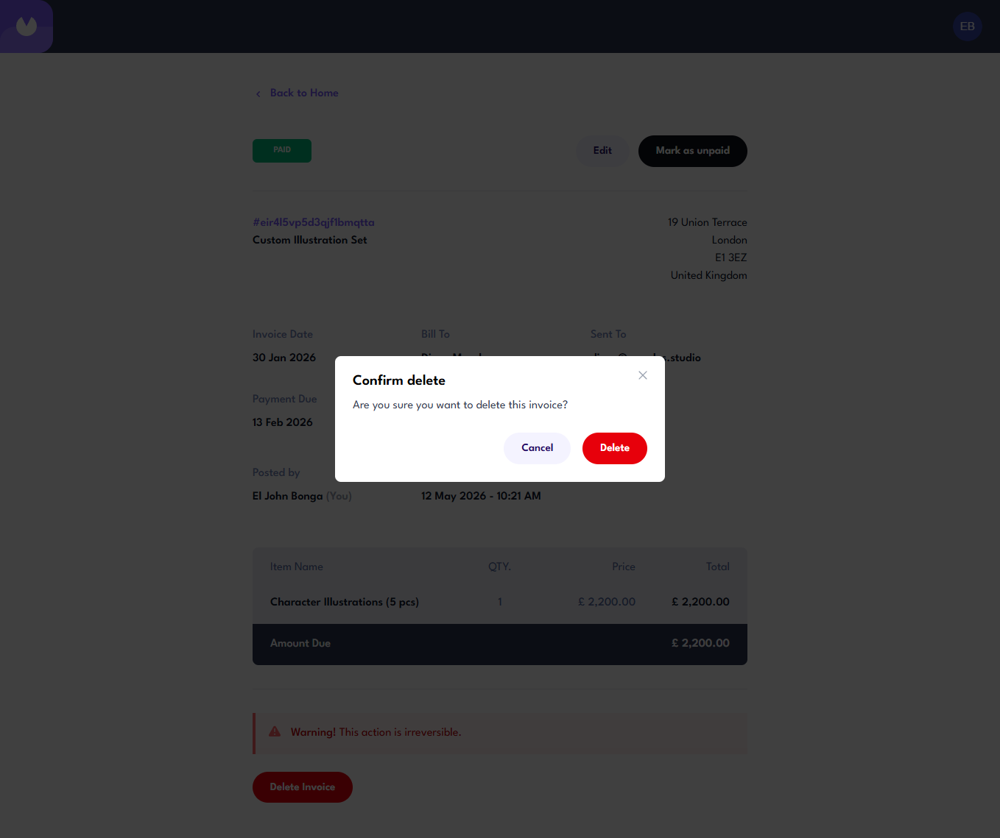
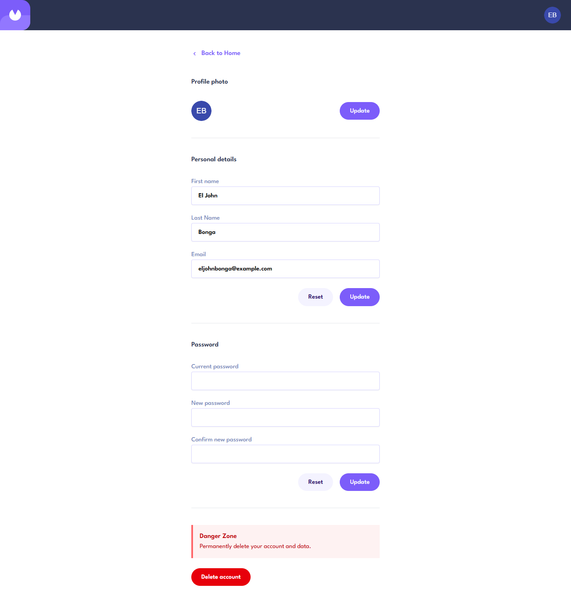

# `Invoicy`

## Description

This repository contains the frontend code for the invoicing application. It serves as the user-facing interface, providing a seamless experience for creating, managing, and tracking invoices through an intuitive UI.

## Motivation

This project originated from a [Frontend Mentor challenge](https://www.frontendmentor.io/challenges/invoice-app-i7KaLTQjl), to which I added additional features to enhance functionality. The primary motivation was to learn full‑stack development by building a complete invoicing application with React on the frontend and FastAPI on the backend (housed in a [separate repository](https://github.com/eljohn316/invoicy-backend)).

## Technology Stack

- [**React**](https://react.dev/) for the main stack.
  - Using TypeScript, hooks, and [**Vite**](https://vite.dev/)
- [**TailwindCSS**](https://tailwindcss.com/) and [**shadcn/ui**](https://ui.shadcn.com/) for styling and UI components.
- [**Axios**](https://axios.rest/) for the HTTP client
- [**Tanstack Router**](https://tanstack.com/router/latest) used for client-side routing.
- [**Tanstack Query**](https://tanstack.com/query/latest) used for async state management and data fetching

## Features

### Login



### Sign Up



### Invoices



### Invoice Details



### Invoice Create



### Invoice Update



### Invoice Delete



### Settings



## Development

> [!IMPORTANT]  
> You must first clone and setup the backend repo first, which can be found [here](https://github.com/eljohn316/invoicy-backend).

1. Clone the repository:

   ```bash
   $ git clone https://github.com/eljohn316/invoicy-frontend
   $ cd invoice-frontend
   ```

2. Install dependencies with pnpm:

   ```bash
   $ pnpm i
   ```

3. Create .env.development

   ```
   VITE_API_URL='http://localhost:8000/api'
   ```

4. Running the app

   ```bash
   $ pnpm dev
   ```

## Links

- [Live Demo]()
- [API Documentation]()
- [Backend Repo](https://github.com/eljohn316/invoicy-backend)
